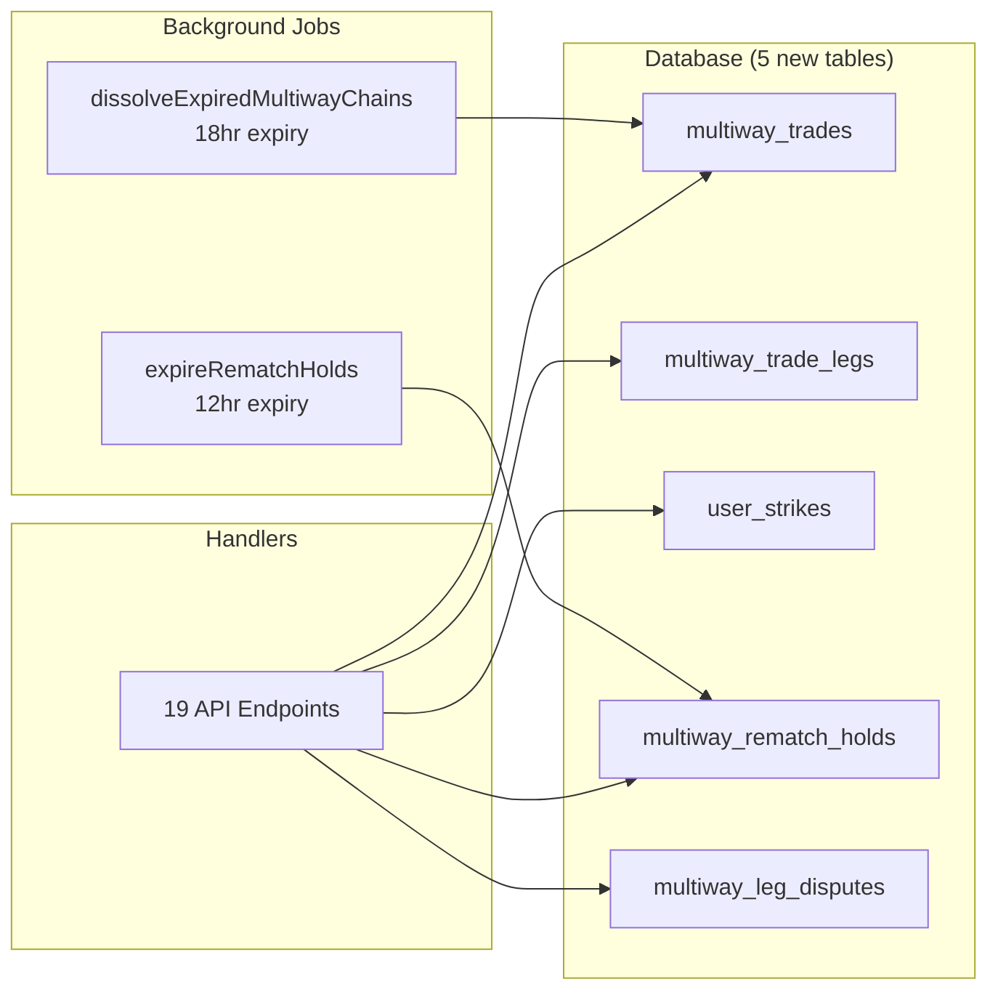

# Multi-Way Trading System — Full Implementation Walkthrough

> All 4 phases implemented and verified with `go build ./...` ✅

---

## Architecture Overview



---

## Phase 1 — Foundation (MVP) ✅

**Goal**: Get the 3-party matching engine live with premium gating and time-boxed acceptance.

| Change | File | Detail |
|--------|------|--------|
| 3-party DFS cap | [trade_matcher.go](file:///c:/Users/User/OneDrive/Desktop/softwareengi/closevia/services/trade_matcher.go) | `MaxChainLength = 3` in loop detection |
| 18hr acceptance window | [trade_handler.go](file:///c:/Users/User/OneDrive/Desktop/softwareengi/closevia/handlers/trade_handler.go) | [AcceptMultiwayChain](file:///c:/Users/User/OneDrive/Desktop/softwareengi/closevia/handlers/trade_handler.go#3761-3887) sets `expires_at = NOW() + 18h` |
| Auto-dissolution job | [trade_timeout.go](file:///c:/Users/User/OneDrive/Desktop/softwareengi/closevia/services/trade_timeout.go) | [dissolveExpiredMultiwayChains()](file:///c:/Users/User/OneDrive/Desktop/softwareengi/closevia/services/trade_timeout.go#258-333) runs every 5 min |
| Premium model | Analysis doc | Plus: 5–10 credits/month, Pro: unlimited (soft cap) |
| 9 API endpoints | [main.go](file:///c:/Users/User/OneDrive/Desktop/softwareengi/closevia/main.go) | All registered and functional |

---

## Phase 2 — Core Chain Flow ✅

**Goal**: Per-leg tracking, handoff coordination, privacy-scoped responses, chain health.

### New DB Table
```sql
multiway_trade_legs (chain_id, leg_index, from_user_id, to_user_id, product_id,
                     handoff_method, handoff_location, status, completed_at, ...)
```

### New Endpoints

| Method | Route | Handler | Purpose |
|--------|-------|---------|---------|
| GET | `/trades/multiway/:id/legs` | [GetChainLegs](file:///c:/Users/User/OneDrive/Desktop/softwareengi/closevia/handlers/trade_handler.go#3962-4047) | Privacy-scoped legs + "2 of 3 complete" health |
| PUT | `/trades/multiway/legs/:legId/handoff` | [UpdateLegHandoff](file:///c:/Users/User/OneDrive/Desktop/softwareengi/closevia/handlers/trade_handler.go#4048-4094) | Pair picks meetup or delivery |
| POST | `/trades/multiway/legs/:legId/complete` | [CompleteLeg](file:///c:/Users/User/OneDrive/Desktop/softwareengi/closevia/handlers/trade_handler.go#4095-4179) | Receiver confirms; auto-completes chain when all done |
| GET | `/products/:id/multiway-status` | [GetProductMultiwayStatus](file:///c:/Users/User/OneDrive/Desktop/softwareengi/closevia/handlers/trade_handler.go#4180-4216) | Badge: "in multiway chain" |

### Key Behaviors
- **Auto-leg creation**: 3 legs created inside [AcceptMultiwayChain](file:///c:/Users/User/OneDrive/Desktop/softwareengi/closevia/handlers/trade_handler.go#3761-3887) on User 3 acceptance
- **Privacy scope**: [GetChainLegs](file:///c:/Users/User/OneDrive/Desktop/softwareengi/closevia/handlers/trade_handler.go#3962-4047) returns only legs where the calling user is sender/receiver
- **Auto-completion**: When all 3 legs are confirmed → chain + original trade + products auto-marked completed

---

## Phase 3 — Resilience ✅

**Goal**: Handle post-acceptance back-outs gracefully with re-matching, progressive strikes, and conflict resolution.

### New DB Tables
```sql
user_strikes (user_id, chain_id, strike_number, severity, restricted_until, ...)
multiway_rematch_holds (chain_id, backed_out_user_id, hold_expires_at, status, replacement_user_id, ...)
```

### New Endpoints

| Method | Route | Handler | Purpose |
|--------|-------|---------|---------|
| POST | `/trades/multiway/:id/backout` | [BackOutChain](file:///c:/Users/User/OneDrive/Desktop/softwareengi/closevia/handlers/trade_handler.go#4221-4376) | Collapse + strike + 12hr re-match |
| POST | `/trades/multiway/conflict/resolve` | [ResolveMultiwayConflict](file:///c:/Users/User/OneDrive/Desktop/softwareengi/closevia/handlers/trade_handler.go#4462-4523) | Owner picks 2-way or multiway |
| GET | `/products/:id/multiway-conflict` | [CheckMultiwayConflict](file:///c:/Users/User/OneDrive/Desktop/softwareengi/closevia/handlers/trade_handler.go#4414-4461) | Detect dual offers on same product |
| GET | `/admin/multiway-chains` | [AdminGetChains](file:///c:/Users/User/OneDrive/Desktop/softwareengi/closevia/handlers/trade_handler.go#4524-4642) | Paginated admin chain dashboard |
| GET | `/admin/users/:userId/strikes` | [GetUserStrikes](file:///c:/Users/User/OneDrive/Desktop/softwareengi/closevia/handlers/trade_handler.go#4643-4697) | Admin strike viewer |

### Strike System
| Strike | Severity | Consequence |
|--------|----------|-------------|
| 1 | `friendly_warning` | Notification only |
| 2 | `final_warning` | Notification + warning |
| 3+ | `restriction` | **30-day ban** from all multiway trading |

### Background Job
- [expireRematchHolds()](file:///c:/Users/User/OneDrive/Desktop/softwareengi/closevia/services/trade_timeout.go#334-397) — auto-dissolves 12hr holds that found no replacement

---

## Phase 4 — Disputes & Edge Cases ✅

**Goal**: Per-leg dispute isolation so one bad handoff doesn't kill an entire chain.

### New DB Table
```sql
multiway_leg_disputes (chain_id, leg_id, filed_by, against_user_id, reason,
                       evidence_urls JSON, status, resolution_action,
                       upstream_collapse_triggered, ...)
```

### New Endpoints

| Method | Route | Handler | Purpose |
|--------|-------|---------|---------|
| POST | `/trades/multiway/legs/:legId/dispute` | [FileLegDispute](file:///c:/Users/User/OneDrive/Desktop/softwareengi/closevia/handlers/trade_handler.go#4702-4809) | Freeze only this leg |
| PUT | `/admin/multiway-disputes/:disputeId/resolve` | [AdminResolveLegDispute](file:///c:/Users/User/OneDrive/Desktop/softwareengi/closevia/handlers/trade_handler.go#4810-4934) | Resolve with cascading action |
| GET | `/admin/multiway-disputes` | [AdminGetLegDisputes](file:///c:/Users/User/OneDrive/Desktop/softwareengi/closevia/handlers/trade_handler.go#5013-5125) | Impact visualization dashboard |

### Resolution Actions
| Action | Effect |
|--------|--------|
| `no_action` | Unfreeze leg → back to `in_progress` |
| `cancel_leg` | Cancel leg + **upstream collapse** of downstream legs |
| `cancel_chain` | Full chain collapse + restore all products |

### Upstream Collapse Logic
When a leg is cancelled, [upstreamCollapse()](file:///c:/Users/User/OneDrive/Desktop/softwareengi/closevia/handlers/trade_handler.go#4935-5012) walks the chain and cancels all **downstream** incomplete legs:
```
Chain: U1→U2→U3→U1
If leg 1 (U2→U3) is cancelled:
  ✅ Leg 0 (U1→U2) — already completed, preserved
  ❌ Leg 2 (U3→U1) — cancelled (U3 never got their item)
```

---

## Complete API Surface (19 endpoints)

### User-Facing (12)
| # | Route | Phase |
|---|-------|-------|
| 1 | `GET /trades/multiway/opportunities` | P1 |
| 2 | `POST /trades/multiway/:id/accept` | P1 |
| 3 | `POST /trades/multiway/:id/decline` | P1 |
| 4 | `GET /trades/multiway/:id/legs` | P2 |
| 5 | `PUT /trades/multiway/legs/:legId/handoff` | P2 |
| 6 | `POST /trades/multiway/legs/:legId/complete` | P2 |
| 7 | `GET /products/:id/multiway-status` | P2 |
| 8 | `POST /trades/multiway/:id/backout` | P3 |
| 9 | `GET /products/:id/multiway-conflict` | P3 |
| 10 | `POST /trades/multiway/conflict/resolve` | P3 |
| 11 | `POST /trades/multiway/legs/:legId/dispute` | P4 |
| 12 | Various existing multiway handlers | P1 |

### Admin (7)
| # | Route | Phase |
|---|-------|-------|
| 1 | `GET /admin/multiway-chains` | P3 |
| 2 | `GET /admin/users/:userId/strikes` | P3 |
| 3 | `GET /admin/multiway-disputes` | P4 |
| 4 | `PUT /admin/multiway-disputes/:disputeId/resolve` | P4 |
| 5–7 | Existing chain cancel/debug endpoints | P1 |

### Background Jobs (2)
| Job | Interval | Phase |
|-----|----------|-------|
| [dissolveExpiredMultiwayChains](file:///c:/Users/User/OneDrive/Desktop/softwareengi/closevia/services/trade_timeout.go#258-333) | 5 min | P1 |
| [expireRematchHolds](file:///c:/Users/User/OneDrive/Desktop/softwareengi/closevia/services/trade_timeout.go#334-397) | 5 min | P3 |

---

## Files Modified

| File | Changes |
|------|---------|
| [database.go](file:///c:/Users/User/OneDrive/Desktop/softwareengi/closevia/database/database.go) | 5 new tables |
| [trade_handler.go](file:///c:/Users/User/OneDrive/Desktop/softwareengi/closevia/handlers/trade_handler.go) | ~1000 lines added (P2–P4 handlers) |
| [trade_timeout.go](file:///c:/Users/User/OneDrive/Desktop/softwareengi/closevia/services/trade_timeout.go) | 2 background jobs |
| [trade_matcher.go](file:///c:/Users/User/OneDrive/Desktop/softwareengi/closevia/services/trade_matcher.go) | DFS chain cap |
| [main.go](file:///c:/Users/User/OneDrive/Desktop/softwareengi/closevia/main.go) | 19 route registrations |

## Verification
- ✅ `go build ./...` — exit code 0
- ⬜ Full chain lifecycle stress testing (ready for QA)
